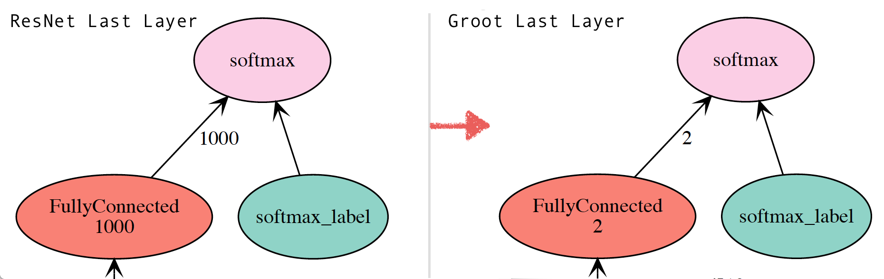
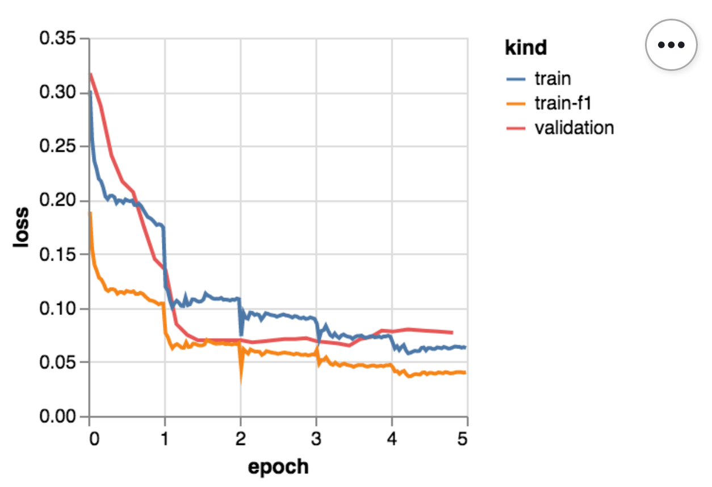

## taking [MXNet](https://mxnet.incubator.apache.org/) for a spin

`doing` is the most efficient way to understand theory behind anything

based on [Clojure MXNet API](https://github.com/apache/incubator-mxnet/tree/master/contrib/clojure-package)
`mxterm` attempts to bring REPL exploratory feel to, at times, pretty science heavy and complex corners of deep learning.

---

# Transfer Learning

transfer learning is twofold:

### fold one: "train the beast"

* someone has lots of GPUs
* someone takes a lot of data
* someone creates or chooses an architecture
  - i.e. the shape of neural network:
    - what layers to use
    - how many of them to use
    - how layers are connected to each other, etc.
* someone trains this architecture with that data on all those fancy GPUs
* someone saves these learned parameters for this architecure
* someone calls these saved parameters a `model` and lets others to use this model

examples of such architectures:

* image classification: [ResNet](https://arxiv.org/abs/1512.03385)
* natural language processing: [Wikitext 103](https://arxiv.org/abs/1801.06146)

### fold two: "train the beauty"

* you take that "pretrained" model
* you replace its "head"
  - by adding your layer as the last layer of that pretrained model
    (i.e. model was trained to understand English, but you need to train it to write poems: so you are going to train this last layer with poems)
* you train this model with your new data (poems, your classified images, etc.)

Hence the new model would be well tuned to your data by relying on all that wisdom from the pretrained model + some your additional training.

# Train a custom image classifier

> _this is going to be somewhat similar to the mxnet "[Fine-tune with Pretrained Models](https://mxnet.incubator.apache.org/versions/master/faq/finetune.html)" example, but on a custom set of images, in Clojure and a little different._

Instead of traning on [Caltech256](https://authors.library.caltech.edu/7694/) dataset, we'll take a custom dataset of images with two categories: "`human`" and "`not human`".

This is an example (in this case it is for a home Raspberry Pi camera to detect package deliveres, strangers, etc..), you can come up with different images and different categories of course.

## Encode images into RecordIO

Before plugging these images into MXNet, they need to be converted to RecordIO format which is done by [dev-resources/groot/make-datasets.sh](dev-resources/groot/make-datasets.sh) script that uses MXNet's `im2rec.py` that encodes all the images _with their labels_ into `.rec` files. [Here](https://mxnet.incubator.apache.org/versions/master/architecture/note_data_loading.html) is more on why and how.

## Download a pretrained model

Since there is already a few great options for pretrained models in the space of image recognition we'll train our model on top of "ResNet". We'll take an 18 layer pretrained model:

```bash
wget http://data.mxnet.io/models/imagenet/resnet/18-layers/resnet-18-0000.params -P model
wget http://data.mxnet.io/models/imagenet/resnet/18-layers/resnet-18-symbol.json -P model
```

> why only 18 layers?

the reason it is 18 and not 50 or 152 layers, which are also available, is that the idea is to iterate quickly and see what works and what does not. 18 layer model is more shallow and takes a lot less time to train and experiment with. Once the right approach and hyper parameters are figured out, you can download a 152 layer ResNet and train on top of that.

here is what `./data` and `./model` look like now:

```bash
$ tree data
data
└── groot
    ├── groot-train.idx
    ├── groot-train.lst
    ├── groot-train.rec
    ├── groot-valid.idx
    ├── groot-valid.lst
    └── groot-valid.rec
```

```bash
$ tree model
model
├── resnet-18-0000.params
└── resnet-18-symbol.json
```

`groot` is a name of a little Raspberry Pi home camera that guards an important corner of the galaxy.

## Learning things

MXNet comes in two flavors: [Gluon API](https://mxnet.incubator.apache.org/api/python/gluon/gluon.html) and [Module API](https://mxnet.incubator.apache.org/api/python/module/module.html). Clojure bindings are currently based on Module API that are basd on Scala mxnet bindings that are based on [JNI bindings](https://github.com/apache/incubator-mxnet/tree/master/scala-package/native). Clojure Gluon API are currently [proposed](https://cwiki.apache.org/confluence/pages/viewpage.action?pageId=103089990).

Module API are not complex, but quite different from a "traditional" deep learning flow (i.e. PyTorch, Tensorflow, Keras, etc.) hence take time to wrap one's mind around.

`mxterm` wraps Clojure Module API for its examples simply because _the focus_ is not on any particular API, but rather on _how and why things are done in deep learning_. Besides the source is open and there are several Clojure Module API [examples](https://github.com/apache/incubator-mxnet/tree/master/contrib/clojure-package/examples) to look at plus some [great tutorials](https://arthurcaillau.com/blog/).

### Let's rock and roll:

```clojure
(require '[mxterm.nn :as nn]
         '[mxterm.infer :as infer]
```

### Create a data loader

Creating data loader that is capable of providing data, usually by batches:

```clojure
=> (def data-loader (nn/make-data-loader {:train-path "data/groot/groot-train.rec"
                                          :valid-path "data/groot/groot-valid.rec"}))

[21:16:47] src/io/iter_image_recordio_2.cc:172: ImageRecordIOParser2: data/groot/groot-train.rec, use 3 threads for decoding..
[21:16:51] src/io/iter_image_recordio_2.cc:172: ImageRecordIOParser2: data/groot/groot-valid.rec, use 3 threads for decoding..
#'boot.user/data-loader
```

### Make a model

Creating model based on "ResNet 18". This will add our custom layer at the "head" of this pretrained "ResNet 18" model so we can reuse all the pretrained wisdom while training (or in this case "fine tuning") _our_ custom layer of Groot images (from a Raspberry Pi camera):



notice how the model's "head" changed from classifying 1000 categories that ResNet was trained with to just 2 categories that Groot needs.

```clojure
=> (def model (nn/make-model {:arch "model/resnet-18"
                              :data-loader data-loader}))

[21:17:42] src/nnvm/legacy_json_util.cc:209: Loading symbol saved by previous version v0.8.0. Attempting to upgrade...
[21:17:42] src/nnvm/legacy_json_util.cc:217: Symbol successfully upgraded!
#'boot.user/model
```

### GPU is king of deep learning

By default mxterm will train the model on CPU, but if you do have GPU enabled server we can add context when creating a model to let this learner know to learn on top of GPU:

```clojure
=> (def model (nn/make-model {:arch "model/resnet-18"
                              :data-loader data-loader
                              :contexts (nn/run-on {:cores :gpu :cnum 1})}))
```

### Train the model

Usually in deep learning training the model is also called "fitting" that is because we are trying to "fit" all the parameters (a.k.a. weights and biases) to produce expected results:

```clojure
=> (nn/fit model data-loader)

Epoch[0] Batch [10]	  Speed: 205.92 samples/sec	Train-accuracy=0.715909
Epoch[0] Batch [20]	  Speed: 224.40 samples/sec	Train-accuracy=0.752976
Epoch[0] Batch [30]	  Speed: 217.39 samples/sec	Train-accuracy=0.770161
Epoch[0] Batch [40]	  Speed: 216.80 samples/sec	Train-accuracy=0.775915
...      ...
Epoch[0] Batch [300]	Speed: 221.30 samples/sec	Train-accuracy=0.836171
Epoch[0] Batch [310]	Speed: 220.69 samples/sec	Train-accuracy=0.837621
Epoch[0] Batch [320]	Speed: 220.39 samples/sec	Train-accuracy=0.838396
Epoch[0] Batch [330]	Speed: 220.69 samples/sec	Train-accuracy=0.839690

Epoch[0] Train-accuracy=0.8417279
Epoch[0] Time cost=25629
Epoch[0] Validation-accuracy=0.58284885
```

By default `nn/fit` would train for a single epoch.
`58.2%` validation accuracy is not exactly high, let's train it with some more epochs and with better metrics:

#### Better metrics

Metrics are extremely important during training, since it is the only way to have some understanding of how the training is going, and whether and how we need to change hyper parameters (i.e. learning rate, regularization, momentum, etc.) to train better: faster, more accurate, etc.

When training a classification model it is often good to use an [F1](https://en.wikipedia.org/wiki/F1_score) (FBeta) metric that takes into the count classes that are not well balanced. Again does not affect training, but gives a much more accurate visual of how successful or not the training is.

Let's create a composed metric from both `accuracy` and `f1`:

```clojure
=> (require '[org.apache.clojure-mxnet.eval-metric :as em])

=> (def metric (em/comp-metric [(em/accuracy) (em/f1)]))
#'boot.user/metric
```

and train for 5 more epochs:

```
=> (nn/fit model data-loader {:epochs 5
                              :params {:eval-metric metric}})

Epoch[0] Batch [10]	  Speed: 211.92 samples/sec	Train-accuracy=0.875000
Epoch[0] Batch [10]	  Speed: 211.92 samples/sec	Train-f1=0.920778
Epoch[0] Batch [300]	Speed: 219.48 samples/sec	Train-accuracy=0.910714
Epoch[0] Batch [300]	Speed: 219.48 samples/sec	Train-f1=0.944446
...
Epoch[4] Batch [320]	Speed: 218.28 samples/sec	Train-accuracy=0.941589
Epoch[4] Batch [320]	Speed: 218.28 samples/sec	Train-f1=0.962487
Epoch[4] Batch [330]	Speed: 217.10 samples/sec	Train-accuracy=0.942032
Epoch[4] Batch [330]	Speed: 217.10 samples/sec	Train-f1=0.962771

Epoch[4] Train-accuracy=0.94266224
Epoch[4] Time cost=24886
Epoch[4] Validation-accuracy=0.9625
```

`96.24%` is a much better validation accuracy.

Since this is an accepted accuracy for "ResNet 18" to explore and play with, we can save the model so later we can just fire up REPL, load it and train it some more or use it for predictions:

```clojure
=> (nn/save-model model "model/groot-18")

INFO  org.apache.mxnet.module.Module: Saved checkpoint to model/shroot-18-0000.params
INFO  org.apache.mxnet.module.Module: Saved optimizer state to model/shroot-18-0000.states
#object[org.apache.mxnet.module.Module 0x599149e8 "org.apache.mxnet.module.Module@599149e8"]
```

# Predicting things

Let's load the model we trained and see how well it recognizes humans on pictures it was _not_ trained on: from a validation dataset:

```clojure
=> (def m (nn/load-model "model/groot-18"))
=> m
#object[org.apache.mxnet.module.Module 0x4f09451c "org.apache.mxnet.module.Module@4f09451c"]
```

since the output of this model is a vector of two classes `["human",  "not-human"]`
the model will return a vector of two probabilities the first one will be
a probability that it sees human on the image, the second one a probability it does not.

```clojure
=> (infer/predict m "file:./data/groot/valid/human/04-2018.10-02-19.jpg")
;; [0.9444668 0.05553314]

=> (infer/predict m "file:./data/groot/valid/no-human/07-2018.20-38-06.jpg")
;; [0.1873892 0.8126108]

=> (infer/predict m "file:./data/groot/valid/no-human/01-2019.05-51-47.jpg")
;; [0.004020324 0.99597967]

=> (infer/predict m "file:./data/groot/valid/human/03-2018.11-17-21.jpg")
;; [0.9457831 0.054216918]
```

niice.

# Visualizing things

There many things that can be visualized: data, metrics, models, confusion matricies, etc.

Here are a couple of examples on how to visualize metrics and models.

## Looking at the architecture

Visualizing model is simple:

```clojure
=> (require '[mxterm.nn :as nn])
=> (doc nn/draw)
-------------------------
mxterm.nn/draw
([{:keys [model path data title], :or {data [1 3 224 224], path "./", title "groot"}}])
  creates a PDF with a prety model architecture

    => (nn/draw {:model m :title "resnet-18"})
```

`nn/draw` relies on `org.apache.clojure-mxnet.visualization` which relies on [org.apache.mxnet.Visualization](https://github.com/apache/incubator-mxnet/blob/master/scala-package/core/src/main/scala/org/apache/mxnet/Visualization.scala)

Let's load the model and draw it:

```clojure
=> (def resnet-model (nn/load-model "model/resnet-18"))

[00:46:14] src/nnvm/legacy_json_util.cc:209: Loading symbol saved by previous version v0.8.0. Attempting to upgrade...
[00:46:14] src/nnvm/legacy_json_util.cc:217: Symbol successfully upgraded!
#'boot.user/resnet-model

=> (nn/draw {:model resnet-model :title "resnet-18"})
#object[org.apache.mxnet.Visualization$Dot 0x5457945a "org.apache.mxnet.Visualization$Dot@5457945a"]
```

which will generate a colorful PDF with all the layers in this architecture. Here are some examples of what it does: [doc/resnet-18.pdf](doc/resnet-18.pdf), [doc/groot.pdf](doc/groot.pdf)

## Looking at the metrics

This is the part of deep learning where Clojure really shines I think, mostly due to ClojureScript. `mxterm` relies on [Oz](https://github.com/metasoarous/oz) to draw these:

```clojure
=> (require '[oz.core :as oz] '[mxterm.plot :as p])

=> (oz/start-plot-server!)
19-04-02 04:55:56 reducer-4.local INFO [oz.server:116] - Web server is running at `http://localhost:10666/`

=> (p/plot-losses "dev-resources/groot/recorded-metrics.edn")
```



This is of course a bit bumpy and had to be collected via [custom mertics recorder](https://github.com/tolitius/mxterm/blob/a90c714cf31936a819eecb80a51478332896165e/src/mxterm/metrics.clj#L21-L31) but it's a start.

## What is all this?

`mxterm` is not a replacement for anything. It is mostly an intermediate step to play with and explore MXNet before Clojure implements Gluon API. Clojure Module API are of course more mature and a lot better supported, so if/once Module API make sense you should definitely use it. Meanwhile `mxterm` is here to explore.

## License

Copyright © 2019 tolitius

Distributed under the Eclipse Public License either version 1.0 or (at
your option) any later version.
